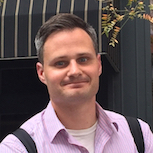
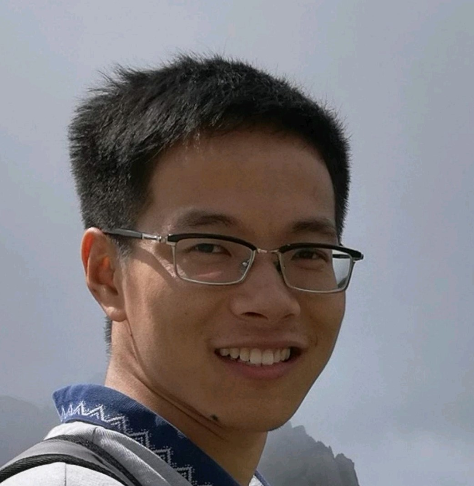
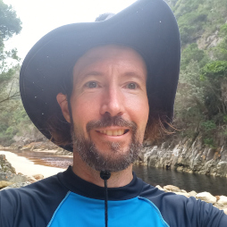
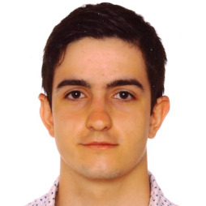
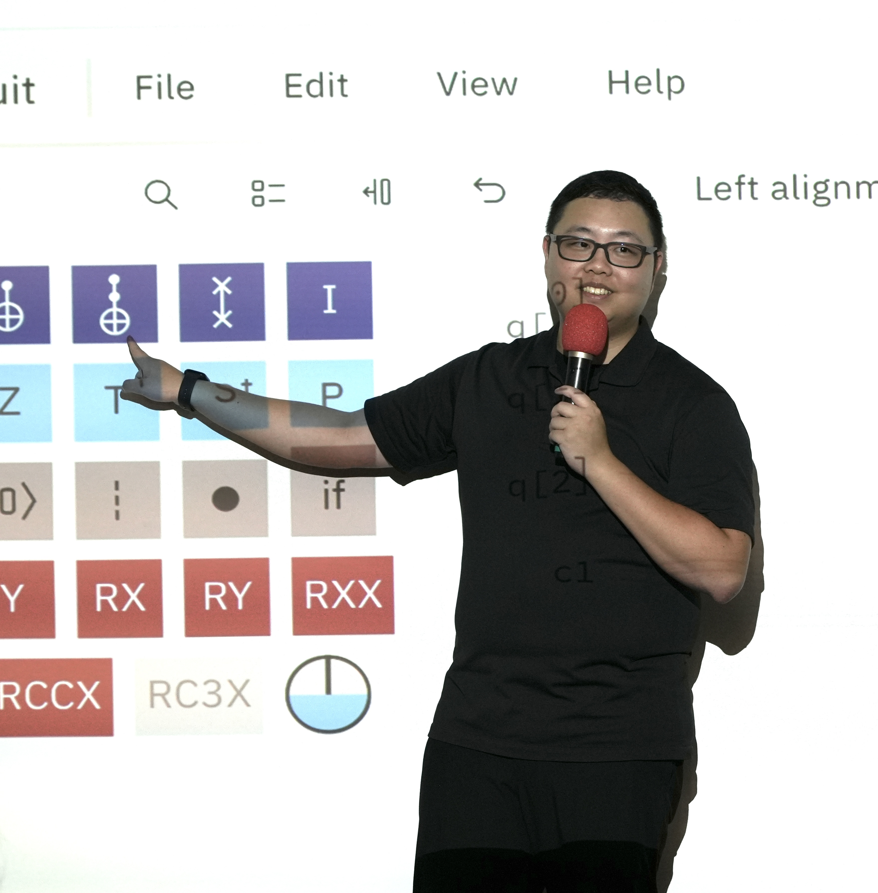
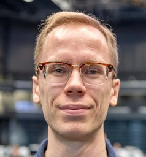
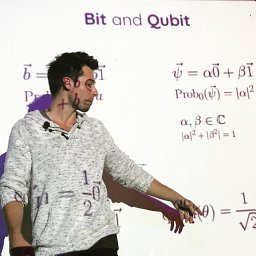
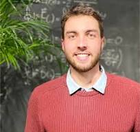

# QuTiP Contributors

The development of QuTiP is a community based effort with several  developers contributing, or helping to add, many new features to the growing list of QuTiP functions.
The governance process and model for the QuTiP project can be found [here](https://github.com/qutip/governance).
It also contains a [charter document](https://github.com/qutip/governance/blob/main/governance.md).

For the detailled list of all our contributors, check out [our Git Hub repositories](https://github.com/qutip).

    

        

            Do you want to contribute to QuTiP? Learn how on
            <a href="https://github.com/qutip" target="about:blank">
                Git Hub
            </a>
            or consider 
            <a href="" target="about:blank">
                donating.
            </a>
        

    

    <h2>
        Original Developers
    </h2>
    

        

            
            <h3>Paul Nation</h3>
            
IBM Q

            
Library designer and main contributor

        

        

            
            <h3>Robert Johansson</h3>
            
Tokyo, Japan

            
Library designer and main contributor

        

    

    <h2>
        Admin Team
    </h2>
    

        

            
            <h3>Alex Pitchford</h3>
            
Aberystwyth University

            
Main focus: Quantum optimal control, solvers

        

        

            
            <h3>Eric Giguère</h3>
            
Université de Sherbrooke

            
Main focus: Stochastic solvers, code optimization

        

        

            
            <h3>Nathan Shammah</h3>
            
RIKEN

            
Main focus: Symmetrical models, education and outreach

        

        

            
            <h3>Shahnawaz Ahmed</h3>
            
Chalmers

            
Main focus: Machine learning, Non-Markovian dynamics

        

        

            
            <h3>Neill Lambert</h3>
            
RIKEN

            
Main focus: Non-Markovian dynamics, counting statistics

        

        

            
            <h3>Boxi Li</h3>
            
Forschungszentrum Juelich

            
Main focus: Quantum control, Quantum device simulation

        

        

            
            <h3>Simon Cross</h3>
            
RIKEN

            
Main focus: Quantum control, machine learning, general maintenance

        

        

            
            <h3>Asier Galicia</h3>
            
Forschungszentrum Juelich

            
Main focus: Core data model and backends

        

        

            
            <h3>Paul Menczel</h3>
            
RIKEN

            
Main focus: Quantum control, non-Markovian solvers, MPI

        

        

            
            <h3>Yi-Te Huang</h3>
            
NCKU, Taiwan

            
Main focus: Quantum Toolbox Julia, non-Markovian dynamics

        

        

            
            <h3>Alberto Mercurio</h3>
            
EPFL, Switzerland

            
Main focus: Quantum Toolbox Julia, quantum optomechanics

        

    

    <h2>
        Board Members
    </h2>
    

        

            
            <h3>Anton Frisk Kockum</h3>
            
Chalmers University of Technology

        

        

            
            <h3>Daniel Burgarth</h3>
            
Macquarie University

        

        

            
            <h3>Franco Nori</h3>
            
RIKEN / University of Michigan

        

        

            
            <h3>Rob Johansson</h3>
            
Rakuten

        

        

            
            <h3>Will Zeng</h3>
            
Unitary Fund

        

    

    <h2>
        Past Members
    </h2>
    

        

            
            <h3>Arne Grimsmo</h3>
            
Université de Sherbrooke

        

        

            
            <h3>Chris Grenade</h3>
            
University of Sydney

        

        

            
            <h3>Jake Lishman</h3>
            
Imperial College London

            
Main focus: Core data model and linear algebra

        

        

            
            <h3>Patrick Hopf</h3>
            
Technical University of Munich

            
Main focus: Quantum control

        

    


