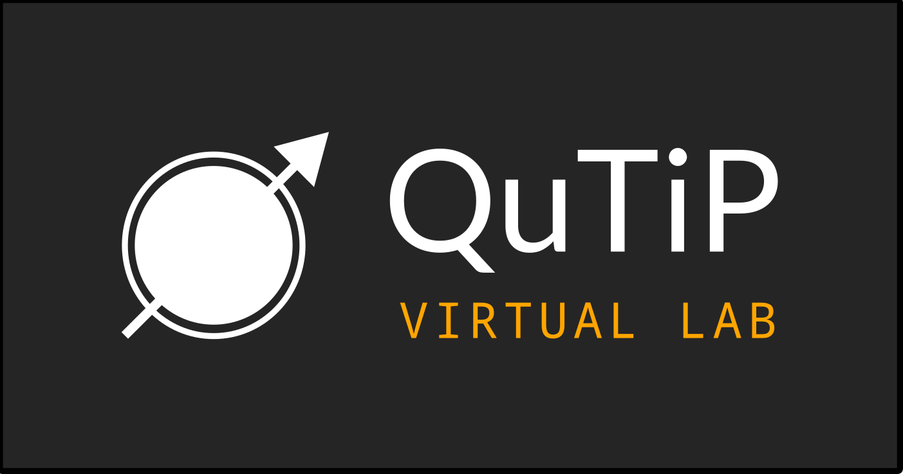

# For Educators

Lorem ipsum dolor sit amet, consectetur adipiscing elit, sed do eiusmod tempor incididunt ut labore et dolore magna aliqua. Ut enim ad minim veniam, quis nostrud exercitation ullamco laboris nisi ut aliquip ex ea commodo consequat. Duis aute irure dolor in reprehenderit in voluptate velit esse cillum dolore eu fugiat nulla pariatur. Excepteur sint occaecat cupidatat non proident, sunt in culpa qui officia deserunt mollit anim id est laborum.

    

        <h2>
            QuTiP in the Classroom
        </h2>
        

            QuTiP is used by educators around the world, teaching the scientists of tomorrow.
        

        

            
            
                

                    

                        <h5 class="card-title">{{ course.institute }}</h5>
                        
{{ course.course }}

                        <a href="{{ course.link }}" class="card-link">Check it out!</a>
                    

                

            
            
        

    

    <h2 class="my-center-section">
        QuTiP Virtual Lab
    </h2>
    

        

            <h5>
                QuTiP Right From the Browser
            </h5>
            

                Lorem ipsum dolor sit amet, consectetur adipiscing elit, sed do eiusmod.
            

            <h5>
                Complex Systems Easily Explained
            </h5>
            

                Lorem ipsum dolor sit amet, consectetur adipiscing elit, sed do eiusmod.
            

            <a href="https://qutip.org/qutip-virtual-lab/" class="mx-auto mx-md-0">
                
                    Enter QuTiP Virtual Lab
                
            </a>
        

        
    

    

        <h2>
            Hand-Crafted Lectures using QuTiP
        </h2>
        

            These lecture-style notebooks focus on particular quantum mechanics topics and their numerical analysis using QuTiP.
        

        <ul class="list-group list-group-flush lecture-list">
            
                <li class="list-group-item notebook-list-item">
                    <a href="{{ lecture.url }}" class="lecture-link">
                        {{ lecture.title }}
                        &#8250;
                    </a>
                </li>
            
            

                
                    <li class="list-group-item notebook-list-item">
                        <a href="{{ lecture.url }}" class="lecture-link">
                            {{ lecture.title }}
                            &#8250;
                        </a>
                    </li>
                
            

        </ul>
        <button class="my-3 btn-show-more" type="button" data-bs-toggle="collapse" data-bs-target="#more-items" aria-expanded="false" aria-controls="more-items" id="show-more-btn">
            Show More
        </button>
    

