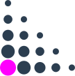

# For Researchers

Lorem ipsum dolor sit amet, consectetur adipiscing elit, sed do eiusmod tempor incididunt ut labore et dolore magna aliqua. Ut enim ad minim veniam, quis nostrud exercitation ullamco laboris nisi ut aliquip ex ea commodo consequat. Duis aute irure dolor in reprehenderit in voluptate velit esse cillum dolore eu fugiat nulla pariatur. Excepteur sint occaecat cupidatat non proident, sunt in culpa qui officia deserunt mollit anim id est laborum.

    

        

            We hope, you enjoy using QuTiP. Please help us make QuTiP even better by
            <a href="/citing">
                citing
            </a>
            it in your publications
        

    

    

        <h2>
            3700+ citations
        </h2>
        

            Check out some selected papers that are making use of QuTiP.
        

        <ul class="list-group list-group-flush lecture-list">
            
                <li class="list-group-item notebook-list-item">
                    <a href="{{ paper.url }}" class="lecture-link">
                        

                            

                                {{ paper.title }}
                            

                            

                                {{ paper.authors }},
                            

                            

                                {{ paper.journal }} ({{ paper.year }})
                            

                        

                        
&#8250;

                    </a>
                </li>
            
        </ul>
        <a href="https://scholar.google.com/scholar?cites=6461191495870975489" target="about:blank" class="m-3 d-inline-block">
            
                More (QuTiP v4)
            
        </a>
        <a href="https://scholar.google.com/scholar?cites=11575350638666079574" target="about:blank" class="m-3 d-inline-block">
            
                More (QuTiP v5)
            
        </a>
    

    

        <h2>
            Technical Features
        </h2>
        

            QuTiP is optimized for performance, completely open-source and tested by thousands of users.
        

        

            

                
                

                    <h5 class="card-title">Open Source Python Library</h5>
                    

                        QuTiP is the original quantum framework written in Python; the most widely used programming language in the quantum sciences.
                        Python's straightforward syntax allows for constructing, manipulating, and evolving quantum objects using QuTiP with just a few lines of code.
                        Easy to learn, and 100% open-source.
                    

                

            

            

                
                

                    <h5 class="card-title">Various Solvers</h5>
                    

                        QuTiP includes a variety of builtin solvers for dynamical simulations.
                        In addition to the standard Lindblad and Monte Carlo Solvers, QuTiP includes routines for Bloch-Redfield evolution, periodic systems using the Floquet formalism, and stochastic solvers.
                        Add to this, steady state analysis and non-Markovian techniques, and you have a wide variety of tools from which to explore your systems behavior.
                    

                

            

            

                
                

                    <h5 class="card-title">Visualizations built in</h5>
                    

                        From Bloch spheres to nonlinear colormaps for Wigner functions, QuTiP includes a host of built-in visualization routines that help bring your data to life.
                        Our plotting utilities have been used by Fortune 500 companies, government research labs, and countless research groups around the globe.
                        If you don't look good, we don't look good.
                    

                

            

            

                
                

                    <h5 class="card-title">Compiled to C++</h5>
                    

                        A wide range of time-dependent evolution simulations can be runtime compiled into C++ behind the scenes using Cython.
                        Thus, you get the ease of use of the Python programming language, and the performance of compiled code, all for free.
                        What can be better than that?
                    

                

            

            

                
                

                    <h5 class="card-title">Proven and Tested</h5>
                    

                        QuTiP is thoroughly tested, both by its thousands of users, and by the large collection of built in test scripts.
                        QuTiP includes over a thousand such tests, covering nearly all of the builtin functions.
                        These tests are run over and over again during development to make sure that the results you get from QuTiP are in fact the correct answers.
                    

                

            

            

                
                

                    <h5 class="card-title">Multiprocessing Ready</h5>
                    

                        QuTiP is capable of leveraging the multiprocessing power inside every modern computer.
                        Taking advantage of the Python multiprocessing library, OPENMP, SSE3 processor extensions, and the Intel MKL, if available, allows for faster manipulation of quantum objects, and increased performance of evolution equations, without any work at all.
                    

                

            

        

    


